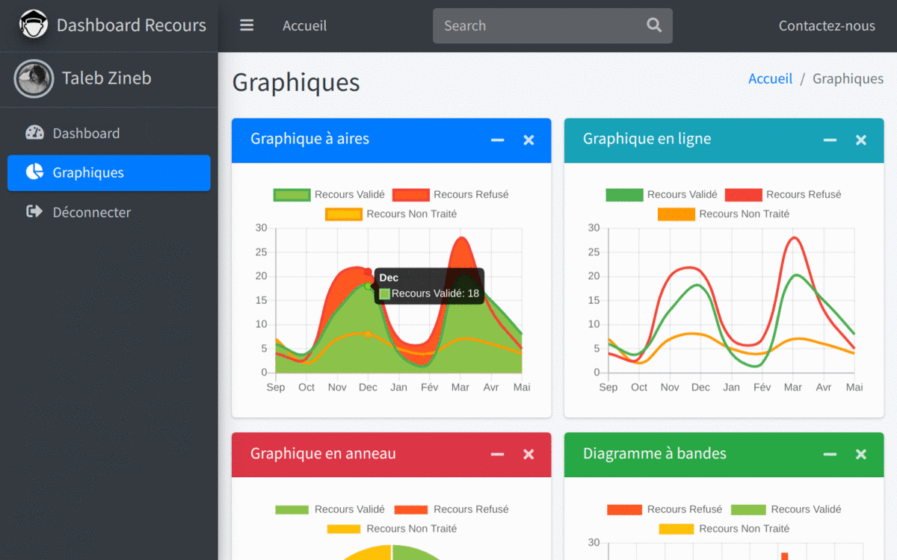

# Dashboard recours

Website to manage recourse in a university


Dashboard recours is a website that can manage recours concerning IT department in a univerity!



## Installation

> `PHP` version 5 is required
1. Run this to clone this repo and make `./script` command executable:
```bash
$ sudo git clone https://github.com/nemo256/DashRecours /var/www/html/project_dir  # for linux users
$ cd project_dir  # this working directory
$ sudo chmod +x script.sh
```
2. This will generate the database with its tables and populate them (run as `sudo` for superuser privileges):
```bash
$ ./script.sh -u [MYSQL-username] -p [MYSQL-password] -d [DB-NAME]
```
3. For more informations run:
```bash
$ ./script.sh -h
```

## Don't have mysql password? (default username = root)

*_NOTE: if [DB-NAME] is not specified 'PFE' is the default value!_*
```bash
$ sudo ./script.sh -d [DB-NAME]
```

## Usage

1. `Student` can add, update, remove a recourse.
2. `Teacher` can validate, refuse a recourse,
3. `Administrator` can manage `Students` and `Teachers`.

## Issues you might run into

For linux users that may have to change ownership of this project for files and images to be copied correctly!
```bash
$ sudo chown -R www-data:www-data /var/www/html/project_dir
```

Please make sure you have mysql running on your computer before running (./script.sh):
```bash
$ mysql -u [USERNAME] -p[PASSWORD]
$ mysql --help  # If any problem occures running the command above.
```
